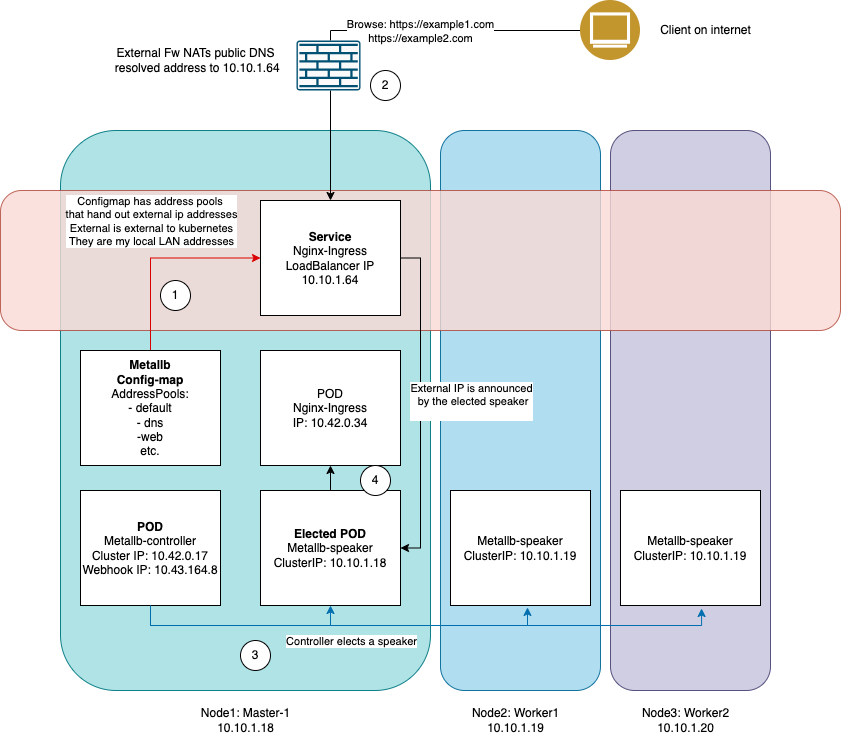
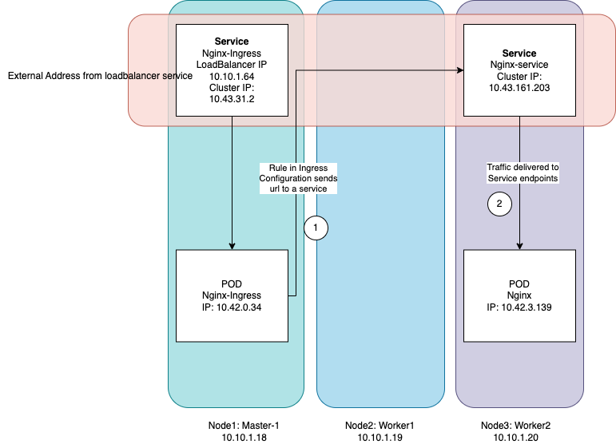

== Implementing NGINX in Kubernetes 

Inleiding....

This kubernetes implementation is quite complex. You will not run this
implementation in one go. Be prepared to do some debugging and troubleshooting.
Using this guide will get you through as well as help you understand how it is
supposed to work

=== A deployment with wordpress, mysql and php.

My setup is a 3 node cluster with 1 master and 2 worker nodes. Harware is
raspberry pi 4 with 4 GB RAM and a 500 GB SSD for each node. The OS is Ubuntu
server 24.04.1 LTS. Kubernetes is k3s version is 1.30.3+k3s1.

I ran in to a lot of problems with the wordpress deployment in particular. I
will try to document the problems and the solutions here. It took me a long time
figuring some of the problems out and the guides I found on the internet did not
seem have any of the problems I had. I hope this blog will be helpful to others.

Firs I will give a description of all components of the entire implementation
with some background information and specific problems I encountered. After that
I will give a step by step guide on how to implement the entire setup.

=== Prerequisites

. Obviously you need to have a kubernetes cluster. I used k3s on raspberry pi 4.

. Persistent Volume manager. I use _Longhorn_. *?* See my blogpost on Longhorn.

. Loadbalancer. I use _MetalLB_. *?* See my blogpost on MetalLB.

. Ingress controller. I use _NGINX-ingress_. *?* See my blogpost on NGINX.

. This guide assumes these components. You can of course use other solutions (like
CEPH, Traefik etc.) but these will not be covered in this guide.

. To follow the guide note that I created an alias for _k=kubectl_ (too much typing).

. You need a docker account. THe account name in this post is referenced as
*<docker-uid>*. You need to replace this with your own docker account name.

=== Quick deployment

If you just want to deploy the entire setup without reading this entire blogpost
you can just grab all the Dockerfiles, yaml files from the repo and put them in
the same directory. Just clone the repo is even better.

You need:

- Dockerfile-nginx
- Dockerfile-phpfpm
- ln-files.sh
- production_issuer.yaml
- staging_issuer.yaml
- phpfpm-deployment.yaml
- phpfpm-clusterip.yaml
- mysql-manifest.yaml
- mysql-deployment.yaml
- mysql-secret.yaml
- nginx-ingress.yaml
- nginx-ingress-svc.yaml
- nginx-deployment.yaml
- nginx-manifest.yaml

Modify each file so it represents your own setup. File paths and directories may
differ from mine. Also you have to change the domains in the files to your own
etc.

Start by building the containers (here for arm64 architecture).  I assume you
have a sites-available directory copied from the nginx server you are migrating
from. In the repo I included an example sites-available directory with two
example domains.

 
----
docker buildx build --platform linux/arm64 \
-t docker.io/<docker-uid>/<nginx-image-name>:latest -f Dockerfile-nginx .

docker buildx build --platform linux/arm64 \
-t docker.io/<docker-uid>/<phpfpm-image-name>:latest -f Dockerfile-phpfpm .
----

Push the images to docker.io

----
docker push docker.io/<docker-uid>/<nginx-image-name>:latest
docker push docker.io/<docker-uid>/<phpfpm-image-name>:latest
----

Apply the yaml files. Preferably in this order.

----
k apply -f mysql-secret.yaml \
k apply -f mysql-deployment.yaml \
k apply -f mysql-manifest.yaml \
k apply -f php-deployment.yaml \
k apply -f php-clusterip.yaml \
k apply -f nginx-ingress.yaml \
k apply -f nginx-ingress-svc.yaml \
k apply -f production_issuer \
k apply -f staging_issuer \
k apply -f nginx-deployment.yaml \
k apply -f nginx-manifest.yaml 
----
You can also put all yaml files in one directory and apply the directory.

This should bring the entire deployment up. If things don't work as expected I
suggest you read the entire blogpost to understand the setup and the problems I
encountered. With the help of this information you should definitely be able to
understand what is going on an fix the problems. If everything works in one go,
congratulations! Maybe you still want to read the rest in case you run into some
problem later on.

=== Docker containers

==== NGINX

First I created a Dockerfile for NGINX. I used the official NGINX image. I
already had this configuration running on a VM. It was a server implementation
with a couple of virtual hosts. I decided to just copy the configuration files
in the Dockerfile. I did not copy the nginx.conf file because I wanted to use a
configmap in Kubernetes for that. I upload every container to DockerHub. These
containers are marked "Private" as they contain information that is strictly for
my use only. The Dockerfile looks like this:

.Dockerfile-nginx
[source, docker]
----
FROM nginx:latest
LABEL maintainer="john@doe.com"
RUN mkdir -p /etc/nginx/sites-available
RUN mkdir -p /etc/nginx/sites-enabled
COPY ./sites-available /etc/nginx/sites-available
COPY ./ln-files.sh /root/ln-files.sh
RUN root/ln-files.sh

EXPOSE 443/tcp
EXPOSE 80/tcp
----

the ln-files.sh script is a simple script that creates symbolic links in the
sites-enabled directory. The script looks like this:

.ln-files.sh
[source, bash]
----
#!/bin/bash

declare -a bestanden
for file in /etc/nginx/sites-available/*
do
    bestanden=("${bestanden[@]}" "$(basename $file)")
done
echo ${bestanden[@]}
for bestand in ${bestanden[@]}
do
    ln -s /etc/nginx/sites-available/$bestand /etc/nginx/sites-enabled/$bestand
done
----

I build the image for arm64 and pushed it to DockerHub as a private container.
This image can now be used in the deployment file.

==== PHP

Next there is a container for PHP. Here I also created a custom image derived
from the official php:fpm-alpine image. It is nothing fancy but you need extra
packages in the container to run wordpress. These are php extensions for mysqli,
exif and gd. I stumbled across this myself when I tried to run wordpress
withouth these extensions. It generates errors that point to these extensions.
The Dockerfile looks like this:

.Dockerfile-php
[source, docker]
----
FROM php:fpm-alpine
RUN apk add libpng-dev
RUN docker-php-ext-install mysqli
RUN docker-php-ext-install exif
RUN docker-php-ext-install gd
----

It is also a build for ARM64. I pushed to Dockerhub as a public repository. So
you can save yourself the trouble of building this image yourself and just use
mine. The image can be pulled at:

----
rinmeister/phpfpm-mysqli:latest
----

==== MySQL

Finally you also need an MySQL container. For this I just used the official
image: _mysql:latest_. So I did not create a custom image for this. The
databases are stored in a persistent volume and are imported in the database
after it has been deployed. More about that later.

=== Setting up MySQL in kubernetes

The requirements for SQL:

- support for multiple databases
- support for multiple users.

I did not succeed in setting up multiple users. I can set up a root user and one
administrative account but that's it. So right now I am using that. If a need
another user I set it up after the container is running in MySQL. The database
is stored in a persistent volume and so is the user configuration.

I use two separate yaml files for the deployment. In the first one I create the
service and the persistent volume. This is called the manifest file. The second
is the deployment file. They are separate so I can delete the deployment without
deleting the persistent volume. Here are both files:

==== MySQL manifest file

.mysql-manifest.yaml
[source, yaml]
----
apiVersion: v1
kind: Service
metadata:
  name: wordpress-mysql
  labels:
    app: wordpress
spec:
  type: ClusterIP
  selector:
    app: wordpress
    tier: mysql
  ports:
    - port: 3306
  #clusterIP: None
---
apiVersion: v1
kind: PersistentVolumeClaim
metadata:
  name: mysql-pv-claim
  labels:
    app: wordpress
spec:
  accessModes:
    - ReadWriteOnce
  storageClassName: longhorn
  resources:
    requests:
      storage: 2Gi
----

The service selects all pods the have _app: wordpress_ and _tier: mysql_ labels.
For these pods the service offers a ClusterIP address on port 3306. The
persistent volume claim is made on the longhorn storage class. I am running
longhorn in my cluster and is a prerequisite. Longhorn takes physical disks from
the nodes and creates one pool of storage. This pool is then referred to as a
storage class. Deployments and thus Pods can use this storage by using the
_name: mysql-pv-claim_ in the volume section of the deployment.

==== MySQL deployment 

With these files it is easy to understand the deployment file:

.mysql-deployment.yaml
[source, yaml]
----
---
apiVersion: apps/v1
kind: Deployment
metadata:
  name: wordpress-mysql
  labels:
    app: wordpress
spec:
  selector:
    matchLabels:
      app: wordpress
      tier: mysql
  strategy:
    type: Recreate
  template:
    metadata:
      labels:
        app: wordpress
        tier: mysql
    spec:
      containers:
      - image: mysql:latest
        name: mysql
        env:
        - name: MYSQL_ROOT_PASSWORD
          valueFrom:
            secretKeyRef:
              name: mysql-pass-gd6fh98b8f
              key: password
        - name: MYSQL_DATABASE
          value: wordpress
        - name: MYSQL_USER
          value: wordpress
        - name: MYSQL_PASSWORD
          valueFrom:
            secretKeyRef:
              name: mysql-pass-gd6fh98b8f
              key: password
        ports:
        - containerPort: 3306
          name: mysql
        volumeMounts:
        - name: mysql-persistent-storage
          mountPath: /var/lib/mysql
      volumes:
      - name: mysql-persistent-storage
        persistentVolumeClaim:
          claimName: mysql-pv-claim
----

The deployment selects pods with the _app: wordpress_ and _tier: mysql_ labels.
These labels come back in the template section under metadata. The container is
the latest official image. A number of _docker environment_ variables are set in the
container to be used in MySQL. These are variables that give flexibility to the
container implementation.

- MYSQL_ROOT_PASSWORD: sets the root password for the MySQL database
- MYSQL_DATABASE: sets the database name
- MYSQL_USER: sets the user name
- MYSQL_PASSWORD: sets the password for the user

The password is stored in a secret. This secret can be created using the
following file:

.mysql-secret.yaml
[source, yaml]
----
apiVersion: v1
kind: Secret
metadata:
  name: mysql-pass-gd6fh98b8f
type: Opaque
data:
  password: cGFzc3dvcmQ=
----

Note: The password must be a base64 encoded string. In my case the same password
is used for the root user and the wordpress user. This is not a best practice.
Make sure in a production environment to use different passwords.

Note: Opaque means arbitrary user-defined data.

During the configuration of the different domains we will import the databases
and create more users. You can find this later in the document.

The container listens on port 3306 and mounts the persistent volume
_mysql-pv-claim_ on /var/lib/mysql in the container.

=== Setting op NGINX in Kubernetes

The requirements for the webserver are:

- A webserver for:
    - example1.com
    - example2.com
- Secure connection to all domains using Let's Encrypt
- Redirect all http traffic to https
- Nginx configuration should be easily changeable
- Content must survive a reboot or a crash of the container

I selected NGINX as the webserver of choice. I run it also on the VM that is
currently in use and it runs fine. I am familiar with its configuration so there
was no need to change that setup. Moreover I can retain the configuration files
and just use them in the container. The _nginx.conf_ file is used in a configMap
in k8s. 

==== NGINX

I use the self created private docker container I created earlier. *?* *link naar
boven*. The deployment consists of two files: a deployment with just the
_deployment_ section and a manifest file with the _service_ the _configMap_ and
the _persistentVolumeClaim_ sections. Separating the deployment from the rest
makes it easy to delete the NGINX deployment but keep the persistent files. 

The deployment file is as follows:

.nginx-deployment.yaml
[source, yaml]
----
---
apiVersion: apps/v1
kind: Deployment
metadata:
  name: nginx
spec:
  replicas: 1
  selector:
    matchLabels:
      app: nginx
  template:
    metadata:
      labels:
        app: nginx
      annotations:
        prometheus.io/scrape: "true"
        prometheus.io/port: "9113"
    spec:
      containers:
      - name: nginx
        image: <docker-uid>/<nginx-image-name>:latest
        env:
        - name: WORDPRESS_DB_HOST
          value: wordpress-mysql
        - name: WORDPRESS_DB_PASSWORD
          valueFrom:
            secretKeyRef:
              name: mysql-pass-gd6fh98b8f
              key: password
        - name: WORDPRESS_DB_USER
          value: wordpress
        ports:
        - containerPort: 80
        volumeMounts:
        - mountPath: /etc/nginx/nginx.conf # mount nginx-conf volumn to /etc/nginx
          readOnly: true
          name: nginx-conf
          subPath: nginx.conf
        - mountPath: /var/log/nginx
          name: log
        - mountPath: /var/www
          name: longhorn-pvc
      imagePullSecrets:
      - name: regcred
      volumes:
      - name: nginx-conf
        configMap:
          name: nginx-conf # place ConfigMap `nginx-conf` on /etc/nginx
          items:
            - key: nginx.conf
              path: nginx.conf
      - name: log
        emptyDir: {}
      - name: longhorn-pvc
        persistentVolumeClaim:
          claimName: nginx-pvc
----

There is a prometheus section in the file that is optional. The _env_ section
gets the information needed to login to the MySQL database. *?* *link naar
msql*. container port is 80, but everything is going to be redirected to 443 by
the ingress and certmanager. Beware that this means that the SSL connection is
terminated at ingress and all communication inside the cluster is http. In the
container both TCP 80 and 443 have been opened. There are three volumes mounted
in the container:

- /etc/nginx/nginx.conf: the configuration file for NGINX
- /var/log/nginx: the log files for NGINX
- /var/www: the webroot for NGINX

the section _imagePullSecrets_ is used to pull the image from a private
registry. This is not needed if the image is in a public registry. *?* Link naar
hoe dit te doen.

The first volumeMount is a _configMap_ that is created in the manifest file. The
name of the _configMap_ is _nginx-conf_. The second volume is an _emptyDir_. The
third volume is a _persistentVolumeClaim_. This is also created in the manifest
file. Basically this is where the data is going to be copied. It has to be a
persistent volume so it survives a reboot or a crash of the container. Both this
container and the php container use this volume with the name _nginx-pvc_.

The manifest file looks like below:

.nginx-manifest.yaml
[source, yaml]
----
apiVersion: v1
kind: ConfigMap
metadata:
  name: nginx-conf
data:
  nginx.conf: |
    user www-data;
    worker_processes auto;
    pid /run/nginx.pid;
    #pid /tmp/nginx.pid;
    include /etc/nginx/modules-enabled/*.conf;

    events {
      worker_connections 768;
    }

    http {
      client_body_temp_path /tmp/client_temp;
      proxy_temp_path       /tmp/proxy_temp_path;
      fastcgi_temp_path     /tmp/fastcgi_temp;
      uwsgi_temp_path       /tmp/uwsgi_temp;
      scgi_temp_path        /tmp/scgi_temp;

      sendfile on;
      tcp_nopush on;
      tcp_nodelay on;
      keepalive_timeout 65;
      types_hash_max_size 2048;

      server_names_hash_bucket_size 64;

      include /etc/nginx/mime.types;
      default_type application/octet-stream;

      ##
      # SSL Settings
      ##

      ssl_protocols TLSv1 TLSv1.1 TLSv1.2; # Dropping SSLv3, ref: POODLE
      ssl_prefer_server_ciphers on;

      ##
      # Logging Settings
      ##

      access_log /var/log/nginx/access.log;
      error_log /var/log/nginx/error.log;

      ##
      # Gzip Settings
      ##

      gzip on;

      # gzip_vary on;
      # gzip_proxied any;
      # gzip_comp_level 6;
      # gzip_buffers 16 8k;
      # gzip_http_version 1.1;
      # gzip_types text/plain text/css application/json application/javascript text/xml application/xml application/xml+rss text/javascript;

      ##
      # Virtual Host Configs
      ##

      include /etc/nginx/conf.d/*.conf;
      include /etc/nginx/sites-enabled/*;
    }
---
apiVersion: v1
kind: PersistentVolumeClaim
metadata:
  name: nginx-pvc
spec:
  accessModes:
    - ReadWriteOnce
  storageClassName: longhorn
  resources:
    requests:
      storage: 2Gi
---
apiVersion: v1
kind: Service
metadata:
  name: nginx-service
spec:
  type: ClusterIP
  ports:
  - name: http
    port: 80
    targetPort: 80
  selector:
    app: nginx
----

The data section is a configMap with the nginx.conf data. This is used in the
volumeMount in /etc/nginx/nginx.conf.

The second section is a _persistentVolumeClaim_ with the name _nginx-pvc_. It is
a longhorn persistent volume with a size of 2GB.

The third section is a _service_ with the name _nginx-service_. This is a
CluserIP type. We do not need to expose this service to the outside world, that
is done by the ingress. We do need to expose the pods as a service internally
of course and that is what this service is for. Selector is _app: nginx_. This
means that this service will look for pods with the label _app: nginx_ and will
put them in its service list of pods.

*?* Link naar beneden. In the section below I will explain more about ingress
and how to expose the service to the outside world.

==== Loadbalancer and Ingress

My NGINX implementation is one server that uses virtual hosts to server multiple
domains. To get traffic from external networks into Kubernetes you have to use
preferably a _loadbalancer_. In cloud environments this is a service that is
provided by the cloud provider. In my case I am running my cluster at home and I
have to use something else. I use _MetalLB_ for this. MetalLB provides external
addresses that point to services in the cluster. Check my blogpost about MetalLB
here.

Ingress is a way to route traffic from the outside to services in the cluster.
It is true that MetalLB can do the same but Ingress is much more flexible. What
Ingress *cannot* do is provide you with an external address. You need a
Loadbalancer ore a Nodeport for that. Ingress could be really useful for example
when you want to route traffic to different services (like different webservers)
based on the URL. In my case that is not really necessary because I use virtual
hosts on the same NGINX webserver. So why still use Ingress? That is because it
has a really nice integration with Let's Encrypt. You can use the _cert-manager_
to automatically request and renew certificates for your domains. As SSL
certificates are an absolute must for all websites I decided to use ingress. The
ingress implementation I use is NGINX Ingress. Kubernetes has a default Ingress
implementation with Traefik but the documentation is less elaborate and I am
more familiar with NGINX anyway.

The following pictures help to understand Loadbalancer and Ingress better. It is
a description of my implementation but I think it is a useful visualization for
everyone. The first picture shows that the MetalLB hands out an external address
to the NGINX ingress service (1). Services run throughout the cluster and are not
specific to a pod or a node. A client from the "outside" connects to an url that
is resolved to the external address of the NGINX ingress servicei (2). MetalLB has
elected a speaker that handles the load-balanced traffic and that actually
announces the external IP address (3). So traffic to the external IP address are
routed to the node with the speaker that announces the IP address. After the
node receives the packets, the service proxy routes the packets to ann endpoint
for the service (4). The NGINX service will send the traffic to a pod that qualifies
for the labels that are in its selector. In my case this is the 10.42.0.34.

.Loadbalancer to Ingress

reference to: https://docs.openshift.com/container-platform/4.9/networking/metallb/about-metallb.html

The second picture follows from the first. We have established how traffic gets
from the external address to the NGINX-ingress POD. From there a rule describes
to which service an URL should be routed (1). In my case this is one service (I run
one NGINX server with virtual hosts remember, they all run  behind the same
service). This NGINX service has, again in my case, one endpoint and that is the
POD where the NGINX container runs (2). For clarity: this is the NGINX webserver
container, not the NGINX ingress pod.

.Ingress to NGINX Pod

==== Ingress

I assume you have the ingress controller deployed. The file below is an ingress
file that is applied in the namespace where NGINX is running. It configures the
ingress controller for our webservice. First I will give you the file, followed
by an explanation of the different sections.

.nginx-ingress.yaml
[source, yaml]
----
apiVersion: networking.k8s.io/v1
kind: Ingress
metadata:
  name: nginx-ingress
  annotations:
    cert-manager.io/cluster-issuer: "letsencrypt-prod"
    kubernetes.io/ingress.class: "nginx"
spec:
  tls:
  - hosts:
    - example1.com
    - www.example1.com
    secretName: example1-secret
  - hosts:
    - example2.com
    - www.example2.com
    secretName: example2-secret
  rules:
  - host: example1.com
    http:
      paths:
      - path: "/"
        pathType: Prefix
        backend:
          service:
            name: nginx-service
            port:
              number: 80
  - host: www.example1.com
    http:
      paths:
      - path: "/"
        pathType: Prefix
        backend:
          service:
            name: nginx-service
            port:
              number: 80
  - host: example2.com
    http:
      paths:
      - path: "/"
        pathType: Prefix
        backend:
          service:
            name: nginx-service
            port:
              number: 80
  - host: www.example2.com
    http:
      paths:
      - path: "/"
        pathType: Prefix
        backend:
          service:
            name: nginx-service
            port:
              number: 80
----

There is an annotation that points to _cert-manager_. This is an
annotation for the cert-manager controller issuer-shim that will be explained in
the next section. You can see that ingress is tied to a production letsencrypt
issuer. +
The _tls_section_ is used to *create* and *connect* a certificate to a domain
name or SAN (Subject Alternative Name).

The _rules_ section is used to route traffic to different services.
Please observe that in the rule section all host URLs point to the same
service (nginx-service). This is because I run one NGINX server with a number of
virtual hosts. All traffic is forwarded to the service _nginx-service_ on
TCP/80.

The ingress controller is our entry into the cluster. It must have an external
IP adress and a configuration that selects the Pods that run _ingress-nginx_ and
therefore have this label. To enable this we need a service yaml. You can see how
this works from the drawing. *?* link to tekening met service erin. The service
file looks like below.

.nginx-ingress-svc.yaml
[source, yaml]
----
apiVersion: v1
kind: Service
metadata:
  annotations:
    metallb.universe.tf/address-pool: web
  labels:
    helm.sh/chart: ingress-nginx-4.11.2
    app.kubernetes.io/name: ingress-nginx
    app.kubernetes.io/instance: ingress-nginx
    app.kubernetes.io/version: 1.30.3
    app.kubernetes.io/managed-by: Helm
    app.kubernetes.io/component: controller
  name: ingress-nginx-controller
  namespace: ingress-nginx
spec:
  type: LoadBalancer
  externalTrafficPolicy: Local
  ports:
    - name: http
      port: 80
      protocol: TCP
      targetPort: http
    - name: https
      port: 443
      protocol: TCP
      targetPort: https
  selector:
    app.kubernetes.io/name: ingress-nginx
    app.kubernetes.io/instance: ingress-nginx
    app.kubernetes.io/component: controller
----

Here you can see that this is a service of type LoadBalancer. As an address we
want an address from the pool _web_. This is an address-pool configured the
MetalLB configuration. This addresspool consists of one IP address so we are
sure that the service will always get the same external IP address. This is
important because we need to point our DNS records to this address and we do not
want to change that around all the time. + 
Next you will see that the service listens to two ports 80 and 443. All SSL
traffic is terminated on the ingress controller and is forwarded, _unencrypted_,
on port 80. The selector has three entries and on the pod you have to see all
these three labels being present. Only then the pod will be registered into this
service. To check that describe the service and check the endpoints. It is also
possible to describe the pod and compare the labels. In the output below you can
see that the service registered the endpoint 10.42.0.34. This is the ingress pod
which you can see in the output of the describe pod command.

[source, bash]
----
❯ k describe svc ingress-nginx-controller
Name:                     ingress-nginx-controller
Namespace:                ingress-nginx
Labels:                   app.kubernetes.io/component=controller
                          app.kubernetes.io/instance=ingress-nginx
                          app.kubernetes.io/managed-by=Helm
                          app.kubernetes.io/name=ingress-nginx
                          app.kubernetes.io/part-of=ingress-nginx
                          app.kubernetes.io/version=1.30.3
                          helm.sh/chart=ingress-nginx-4.11.2
Annotations:              meta.helm.sh/release-name: ingress-nginx
                          meta.helm.sh/release-namespace: ingress-nginx
                          metallb.universe.tf/address-pool: web
                          metallb.universe.tf/ip-allocated-from-pool: web
Selector:                 app.kubernetes.io/component=controller,app.kubernetes.io/instance=ingress-nginx,app.kubernetes.io/name=ingress-nginx
Type:                     LoadBalancer
IP Family Policy:         SingleStack
IP Families:              IPv4
IP:                       10.43.31.2
IPs:                      10.43.31.2
LoadBalancer Ingress:     10.10.1.64
Port:                     http  80/TCP
TargetPort:               http/TCP
NodePort:                 http  30558/TCP
Endpoints:                10.42.0.34:80
Port:                     https  443/TCP
TargetPort:               https/TCP
NodePort:                 https  32599/TCP
Endpoints:                10.42.0.34:443
Session Affinity:         None
External Traffic Policy:  Local
HealthCheck NodePort:     32684
Events:                   <none>

❯ k get pods -o wide
NAME                                       READY   STATUS    RESTARTS     AGE   IP           NODE       NOMINATED NODE   READINESS GATES
ingress-nginx-controller-55dd9c5f4-lkx8l   1/1     Running   8 (9d ago)   16d   10.42.0.34   k-master   <none>           <none>
----

==== Cert-manager

As said before, NGINX ingress has a nice integration with Let's Encrypt. In fact
it is the top reason why we use an ingress controller for this implementation.
Handing out and maintaining LetsEncrypt certificates is done through
_cert-manager_, a Kubernetes add-on that automates the management and issuance of
TLS certificates.

I installed certmanager with a helm chart. We are currently at version 1.15.3
but please check for current versions when you read this. The installation is
done with the following command:

----
helm repo add jetstack https://charts.jetstack.io
helm repo update
helm install cert-manager jetstack/cert-manager --namespace cert-manager --version v1.15.3 --set installCRDs=true
----

or follow: https://cert-manager.io/docs/installation/helm/

This will install cert-manager in the namespace cert-manager. You should see the
following services and pods:

----
❯ k get svc
NAME                   TYPE        CLUSTER-IP      EXTERNAL-IP   PORT(S)    AGE
cert-manager           ClusterIP   10.43.171.145   <none>        9402/TCP   31d
cert-manager-webhook   ClusterIP   10.43.159.163   <none>        443/TCP    31d

❯ k get pods
NAME                                       READY   STATUS    RESTARTS       AGE
cert-manager-9647b459d-wxnmq               1/1     Running   7 (10d ago)    11d
cert-manager-cainjector-5d8798687c-ffrkw   1/1     Running   14 (10d ago)   11d
cert-manager-webhook-c77744d75-4hrn5       1/1     Running   9 (4d4h ago)   11d
----

A lot of documentation can be found about cert-manager and how to us it. In most
descriptions there is a staging issuer and a production issuer. I tried the
staging issuer first and that worked fine. In the final implementation I
describe here I just use the production issuer. I had a lot of trouble with
issuing certificates but we will get in to that later.

The way cert-manager works is by using an ingress-shim. A shim can be looked at
as a side-car to container process. It is a process that runs alongside the main 
process and does some work for it. In this case the ingress-shim watches the
ingress resources. If it sees an Ingress with the right annotations it will
install and maintain a certificate with the name provided in the certificate
definition. The annotation has to be put in the ingress definition. In my case
this is:

----
annotations:
    cert-manager.io/cluster-issuer: "letsencrypt-prod"
----

In the namespace of NGINX you now need to create the production ClusterIssuer.
This is a kubernetes yaml file with the kind: ClusterIssuer. ClusterIssuers
represent Certificate Authorities. Let's Encrypt is such an authority. Through a
process of validation they can verify and vouch for the authenticity of your
domain. 

Source: https://cert-manager.io/docs/concepts/issuer/

Below is the yaml file for the ClusterIssuer in my setup. I called it
_production_issuer.yaml_. For completeness sake I als include the
_staging_issuer.yaml_ that I used for testing but which I do not use in the
final implementation.

.production_issuer.yaml
[source, yaml]
----
apiVersion: cert-manager.io/v1
kind: ClusterIssuer
metadata:
  name: letsencrypt-prod
  namespace: cert-manager
spec:
  acme:
    # The ACME server URL
    server: https://acme-v02.api.letsencrypt.org/directory
    # Email address used for ACME registration
    email: john@doe.com
    # Name of a secret used to store the ACME account private key
    privateKeySecretRef:
      name: letsencrypt-prod
    # Enable the HTTP-01 challenge provider
    solvers:
    - http01:
        ingress:
          class: nginx
----

ACME stands for Automated Certificate Management Environment. It is a protocol
for automating certificate lifecycle management communication between a CA and a
Web server.

source https://www.sectigo.com/resource-library/what-is-acme-protocol

This file points to the CA which in our case is LetsEncrypt. A mail address is
provided and the file also creates a secret that stores the private key. Lastly
a challenge solver is defined. This defines how Lets Encrypt is going to verify
that a domain really belongs to you. In this case this is done through an HTTP
challenge. This means that LetsEncrypt expects a file with a certain name and
content to be available on a certain URL in your domain. This proves you are the
owner of the domain because only if you are the owner of the domain you can
place this content there.

The staging issuer is very similar. The only difference is the server URL and the
name of the issuer. The server URL points to the staging environment of Lets
Encrypt. This is a test environment where you can test your setup without
actually issuing a certificate.

.staging_issuer.yaml
[source, yaml]
----
apiVersion: cert-manager.io/v1
kind: ClusterIssuer
metadata:
 name: letsencrypt-staging
 namespace: cert-manager
spec:
 acme:
   # The ACME server URL
   server: https://acme-staging-v02.api.letsencrypt.org/directory
   # Email address used for ACME registration
   email: john@doe.com
   # Name of a secret used to store the ACME account private key
   privateKeySecretRef:
     name: letsencrypt-staging
   # Enable the HTTP-01 challenge provider
   solvers:
   - http01:
       ingress:
         class:  nginx
----

In the ingress definition *?* link to ingress we saw a _tls_section_. This
becomes important right now. This section tells kubernetes which domain name and
which SANs (Subject Alternative Names) the certificate should be issued for. The
section also gives a name for the secret where the certificate is stored. So
from the ingress you request and specify the certificate. There is no need to
define and request the certificate in a separate file.

After the _cert-manager_ and _ingress_ have been deployed LetsEncrypt
intitiates a challenge using a http request. First internally to check, then
externally. The challenge file is placed in the .well-known/acme-challenge
directory. This is done by the cert-manager pod. Make sure that the url is
resolvable both internally and externally on http (port 80). I ran into a
problem with the internal check failing. This was because my Cisco ASA firewall
did not hairpin traffic from inside destined for the external IP of my NGINX
implementation (grijsbach.eu resolved to the external IP address from the inside
of my network). So while externally the check worked, I checked that using curl
from an external server, internally the check failed. I solved this by
configuring split DNS where the internal DNS server resolves the domain url to
an internal IP. This way the internal check also worked.

After the challenge has been completed the certificate is issued and stored in
the secret. As stated in the ingress definition the certificate is then used to
secure the connection to the NGINX server by connection it to a domain name or a
SAN. This is all done in the _tls_section_ of the ingress definition.
A number of commands are useful for troubleshooting the issueing of
certificates:

----
#from the namespace where the implementation runs
k describe cert <certname>
k describe order <ordername>
k describe challenge <challenge name>
k describe certificaterequest

#from the cert-manager namespace
k logs <cert-manager-pod>
----

k get certificates should give you a list of certificates that have been issued,
all showing READY being true. If this is not the case you can use the above
commands to troubleshoot.

----
❯ k get certificates
NAME                   READY   SECRET                 AGE
example1-secret        True    example1-secret       143m
example2-secret        True    example2-secret       133m
----

So if everything is correct you now have: 

- Certmanager installed in its own namespace;
- A production clusterIssuer yaml file;
- Ingress with the right annotations
- DNS pointing to the right IP adresses so the cluster reach the Webservice
  internally and externally.

If you deploy this without the NGINX implementation present the certificates
will not be issued of course. After the NGINX deployment they will be because
cert-manager will keep monitoring the ingress resources.

=== Setting up PHP in kubernetes

As stated before I created a custom image for PHP. The PHP service only has to
be reachable internally. So the service kan be of the type ClusterIP. Again
there are two files, a deployment file and a service file. Check the output
below and the explanation that follows.

.phpfpm-deployment.yaml
[source, yaml]
----
---
apiVersion: apps/v1
kind: Deployment
metadata:
  name: phpfpm
  labels:
    app: phpfpm
    layer: backend
spec:
  replicas: 1
  selector:
    matchLabels:
      app: phpfpm
  template:
    metadata:
      labels:
        app: phpfpm
    spec:
      containers:
        - name: phpfpm
          image: <docker uid>/phpfpm-mysqli:latest
          ports:
            - containerPort: 9000
          volumeMounts:
            - mountPath: /var/www
              name: longhorn-pvc
      volumes:
        - name: longhorn-pvc
          persistentVolumeClaim:
            claimName: nginx-pvc
----

By now you should notice that the deployment defines labels. These labels are:

- app: phpfpm
- layer: backend

The pod template selects the deployment that has the label app: phpfpm. The
container used is the custom container the has been created and described
earlier *?* link naar container sectie. It listens on port TCP/9000. Next one
volume is mounted into the container. This is the /var/www directory that is on
the longhorn persistent volume. This is the same volume that is also used by the
NGINX container pods.

.phpfpm-clusterip.yaml
[source, yaml]
----
---
apiVersion: v1
kind: Service
metadata:
  name: phpfpm
  labels:
    app: phpfpm
    layer: backend

spec:
  type: ClusterIP
  selector:
    app: phpfpm

  ports:
    - port: 9000
      targetPort: 9000
----

The service registers pods that have the label app: phpfpm. The service is of
the type ClusterIP. The service listens on port 9000 and forwards the traffic to
the pods on port 9000. The service is only reachable from within the cluster.

Let's check the endpoints of the service. There should be one, the pod that was
created with the deployment file.

[source, bash]
----
❯ k get endpoints phpfpm
NAME     ENDPOINTS          AGE
phpfpm   10.42.3.141:9000   33d
----

=== Reading from a private docker repository

Login to dockerhub (docker.io)
docker login docker.io -u <docker uid>\n

This creates a config.json in ~/.docker with the credentials. This file can be
used to create a secret in kubernetes.

----
kubectl create secret generic regcred --from-file=.dockerconfigjson=/home/john/.docker/config.json --type=kubernetes.io/dockerconfigjson
----

This secret can be used in the deployment file for the pod that needs to pull
the image from the private repository. In the output below this is done by
referring to _regcred_ in the imagePullSecrets section of the container spec.

[source, yaml]
----
    spec:
      #securityContext:
      #  runAsUser: 33  # This is typically the user ID for www-data
      #  fsGroup: 33    # This ensures the container has the right file system group
      containers:
      - name: nginx
        image: rinmeister/nginx-thuis-php:latest
        env:
        - name: WORDPRESS_DB_HOST
          value: wordpress-mysql
        - name: WORDPRESS_DB_PASSWORD
          valueFrom:
            secretKeyRef:
              name: mysql-pass-gd6fh98b8f
              key: password
        - name: WORDPRESS_DB_USER
          value: wordpress
        ports:
        - containerPort: 80
        volumeMounts:
        - mountPath: /etc/nginx/nginx.conf # mount nginx-conf volumn to /etc/nginx
          readOnly: true
          name: nginx-conf
          subPath: nginx.conf
        - mountPath: /var/log/nginx
          name: log
        - mountPath: /var/www
          name: longhorn-pvc
      imagePullSecrets:
      - name: regcred
----

== Troubleshooting

Very often you will have to troubleshoot. 

I often trace from within the pod. For example I wanted to check the internal
web traffic. I wanted to see that ingress terminates traffic on 443 but that the
forwarded traffic from ingress to the pod is on port 80 and therefore
unencrypted. The easiest way to do this is to exect into the pod, install
tcpdump and trace the traffic:

----
k exec -it <podname> -- /bin/bash
apt update
apt install tcpdump
tcpdump -i eth0 port 80
----

Check it out and see for yourself. You can also listen on 443 and you will see no
traffic. Everything is forwarded on port 80. So be sure to protect your nodes
well. Anyone with access to the cluster can sniff in and read the traffic.

== Uploading data

To upload data to the cluster you can use the kubectl cp command. This command
copies files to and from containers. As all data is on the persistent volume and
the mount is /var/www this involves creating the directories and copying all the
data. +
Kubectl has a _cp_ command that can copy local files to a pod. The command
copies files and directories. So to copy the directory  and its contents to the
pod, create the direcory and copy all the content use:

k cp ./<datadir> <podname>:/var/www/. 

After that the fileowner and group should be set to www-data. This can be done
with the chown command. You can either _exec_ into the container or issue
commands from the client terminal. Most of the times I just _exec_ into the pod.

In the NGINX container the user www-data has been created as the web server user
that owns all the data files. When copying data to the container, make sure that
the owner and group is set to this user. Furthermore, make sure that all file
permissions have been set to 644 and all directory permissions to 755. This is
is the most secure way to set permissions. Never set any permission to 777.

I had a big problem with file permissions causing all kinds of trouble with
wordpress. I could not load the admin page and the site css and php did not load
properly. The problem was the file permissions. I had set all owner and group
configuration to www-data and the problem still persisted. I troubleshooted for
a long time and eventually found out that the problem did not come from my NGINX
pod, but from the PHP pod. All actions are php scripts that are executed by the
PHP pod on the same volume. The PHP pod runs on Alpine and in Alpine the
www-data user is using a userID of 82. This is different from the www-data user
in ubuntu. So I ended up changing the owner and group to 82 and the problem was
solved.

The commands to set the correct file permissions from the current directory:

[source, bash]
----
find ./ -type d | xargs chmod 755
find ./ -type f | xargs chmod 644
----

The command to set the owner and group to 82 to every subdirectory of /var/www:

[source, bash]
----
chown -R 82:82 /var/www
----

== Configure Wordpress

After all containers are running and you have made sure that the certificates
all work it is time to configure Wordpress. Basically you just follow the
official guide provided by Wordpress. You can also follow the wizard that is run
when you first access the site. Because of my problems with the permissions (see
previous section) I just edited the wp-config.php file. First I created another
client user in MySQL and granted it permissions to the client database. I tried
to set this up during installation of the container but that did not work. So in
the end I exec-ed into the MySQL database Pod and created a user by hand. MySQL
also uses Persistent Volumes so the user will be there even after a restart or
recreation of the Pod.

.add user to MySQL
[source, SQL]
----
CREATE USER 'client'@'localhost' IDENTIFIED BY 'password';
GRANT ALL PRIVILEGES ON <database>.* TO 'client'@'localhost';
----

If you need to import a database into MySQL first copy the sql file into the
container. Then you can use the following SQL command:

.import database
[source, SQL]
----
mysql -u root -p wp_users < wp_users.sql
----

After that edit the wp-config.php file. I spent a lot of time getting this
right. In the end the file is as below.

.wp-config.php
[source, php]
----
<?php
/**
 * The base configuration for WordPress
 *
 * The wp-config.php creation script uses this file during the installation.
 * You don't have to use the website, you can copy this file to "wp-config.php"
 * and fill in the values.
 *
 * This file contains the following configurations:
 *
 * * Database settings
 * * Secret keys
 * * Database table prefix
 * * ABSPATH
 *
 * @link https://developer.wordpress.org/advanced-administration/wordpress/wp-config/
 *
 * @package WordPress
 */
define('FORCE_SSL_ADMIN', true);

if( strpos($_SERVER['HTTP_X_FORWARDED_PROTO'], 'https') !== false )
   $_SERVER['HTTPS'] = 'on';
else
   $_SERVER['HTTPS'] = 'off';

// ** Database settings - You can get this info from your web host ** //
/** The name of the database for WordPress */
define( 'DB_NAME', 'db-name' );

/** Database username */
define( 'DB_USER', 'db-username' );

/** Database password */
define( 'DB_PASSWORD', 'Password' );

/** Database hostname */
define( 'DB_HOST', 'wordpress-mysql' );

/** Database charset to use in creating database tables. */
define( 'DB_CHARSET', 'utf8mb4' );

/** The database collate type. Don't change this if in doubt. */
define( 'DB_COLLATE', '' );

/**#@+
 * Authentication unique keys and salts.
 *
 * Change these to different unique phrases! You can generate these using
 * the {@link https://api.wordpress.org/secret-key/1.1/salt/ WordPress.org secret-key service}.
 *
 * You can change these at any point in time to invalidate all existing cookies.
 * This will force all users to have to log in again.
 *
 * @since 2.6.0
 */
define( 'AUTH_KEY',         'hJCUQp&.[2 3.*$oCXHyU$9{/iK!6#~qHfXVnXa*[l1+iOtgZtf%AX*/PU%m`?(t' );
define( 'SECURE_AUTH_KEY',  'glI.y0CM2lFJY3y*A@vl*(6Iqj}Tz!]2fa>vDY(Hx3JMd#y@SJ^VL!-;3nhU(OXR' );
define( 'LOGGED_IN_KEY',    'LWg|}=j{;RpSBGc-6,U96CG(=1CYL`@9<(~5_x~B1>{XAgP6@(TSJ`W1X;Vf4[A4' );
define( 'NONCE_KEY',        '`QMw S@>7s,H)1z/Az|d4O[)LjSw+CDexb-HrA#}NMfb}M F,Qa*C0s.!,q!:p%0' );
define( 'AUTH_SALT',        '&HjX;Z`Skw {*QqG`r>n5YsW&i>AGd.WbZTdVm](0mE{ZXZ7uf^&Jz5uuO;i~S}t' );
define( 'SECURE_AUTH_SALT', ':L~l!v_C>PGkVWScG% ;B*$$8*4XGA={uswR$|0JK8V~/R+rfm#S ,2HjBO%*gP6' );
define( 'LOGGED_IN_SALT',   's*Okpl:&g!0!ojv{$]rcC,6>f]>OdK~k(!i c&~(2$=?e@FnDuK:*)~M9I)912PU' );
define( 'NONCE_SALT',       'NPx)N,P@+}#<DMH]Tb/axhRK/zo~SGz }GG3HD0$c*F`nrd;FgRT!jpzs2D^-Swa' );

/**#@-*/

/**
 * WordPress database table prefix.
 *
 * You can have multiple installations in one database if you give each
 * a unique prefix. Only numbers, letters, and underscores please!
 */
$table_prefix = 'wp_';

/**
 * For developers: WordPress debugging mode.
 *
 * Change this to true to enable the display of notices during development.
 * It is strongly recommended that plugin and theme developers use WP_DEBUG
 * in their development environments.
 *
 * For information on other constants that can be used for debugging,
 * visit the documentation.
 *
 * @link https://developer.wordpress.org/advanced-administration/debug/debug-wordpress/
 */
define( 'WP_DEBUG', false );

/* Add any custom values between this line and the "stop editing" line. */

/* That's all, stop editing! Happy publishing. */

/** Absolute path to the WordPress directory. */
if ( ! defined( 'ABSPATH' ) ) {
        define( 'ABSPATH', __DIR__ . '/' );
}

/** Sets up WordPress vars and included files. */
require_once ABSPATH . 'wp-settings.php';
define('WP_HOME','https://www.example1.com');
define('WP_SITEURL','https://www.example1.com');
define('FS_METHOD', 'direct');
----

There is still some work to do here. As you can see the passwords and other
sensitive information is hardcoded in the file. I tried to use environment
variables in the container for this but that did not work. If you get this
working please let me know.

== Conclusion

This has been a lot of work. My cluster and NGINX is running stable right now. I
do still have some issues that I need to work on. One is the hardcoded passwords
in the wp-config.php file. I also need to get the backups working. Another
annoying thing is that one of the Wordpress websites loads really slow initially.
It is waiting for something, could be a database connection. It takes 15 seconds
for it to load until the opening page. I will have to look into that. But if any
reader has suggestions please let me know. I hope this guide is helpful for
other people that want to run Wordpress in a Kubernetes cluster. There are many
guides on the internet that sort of help you out, but none of them was working
completely for me. So I ended up doing al lot of trial and error and
troubleshooting. That is why I wrote this guide. I hope it helps you out. If you
have any questions or suggestions please let me know. I am happy to try and help
you.

Please mail me at rene@grijsbach.eu
